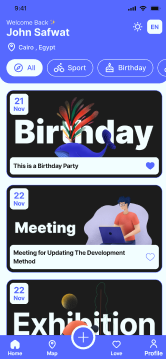
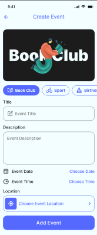
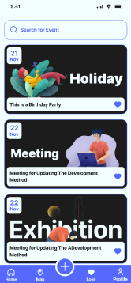
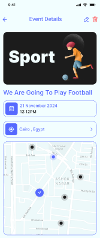
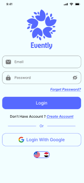
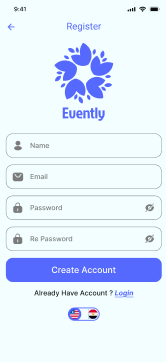
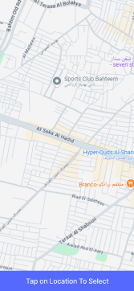

# 📅 Event App

A Flutter-based mobile application that helps users **save, manage, and organize their events** easily.  
Whether it's a **meeting, sport activity, book reminder, birthday, or holiday**, this app keeps everything stored safely using **Firebase**.

---

## ✨ Features

- ✅ **Create & Save Events**  
  Add events like:
  -  Birthday  
  - Book or study reminders  
  - Sports activities  
  -  Meetings  
  -  Holidays  

-  **Firebase Authentication**  
  Secure login and signup using Firebase Auth.

-  **Firebase Firestore Database**  
  All events are stored and retrieved from Firestore.

-  **Search Your Events**  
  Quickly search events by name or category.

-  **Light Mode & Dark Mode**  
  Toggle between light and dark themes.

-  **Language Support**  
  Switch between **Arabic** and **English**.

---

## 📸 Screenshots


###  Home Screen  


###  Add Event  


###  Search Screen  


###  Event Details


###  Add Event  


###  Search Screen  


###  Sign in


###  Sign Up


###  Location 



---

## 🛠️ Tech Stack

- **Framework:** Flutter  
- **Language:** Dart  
- **Backend:** Firebase  
  - Firebase Authentication  
  - Cloud Firestore  
- **Multilingual Support:** Arabic & English  
- **Themes:** Light and Dark Mode  

---

##  Getting Started

### 1️ Prerequisites
- Flutter SDK  
- Android Studio or VS Code  
- Firebase project configured  
- Emulator or real device

### 2 Installation

```bash
# Clone the repository
git clone https://github.com/your-username/Event-App.git

# Navigate to project directory
cd event

# Get dependencies
flutter pub get

# Run the app
flutter run
